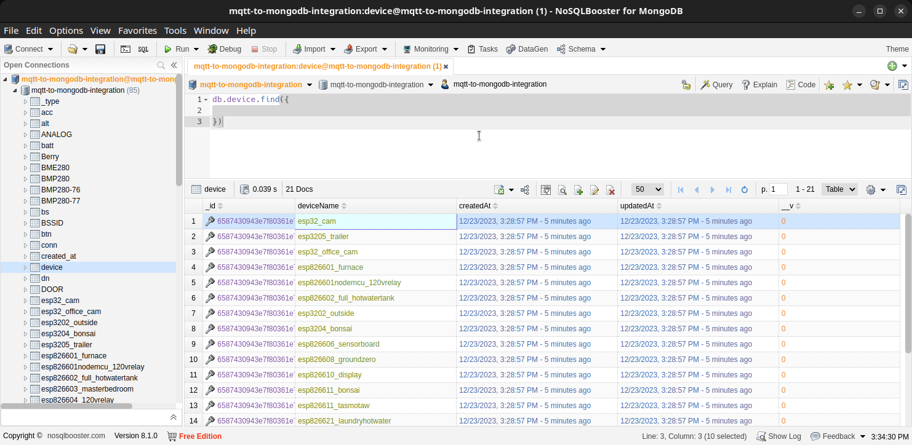
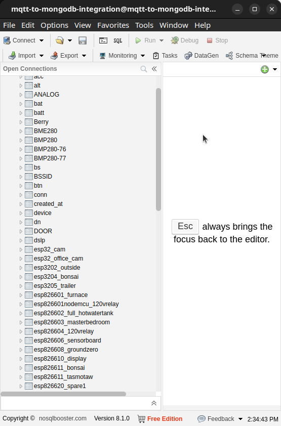
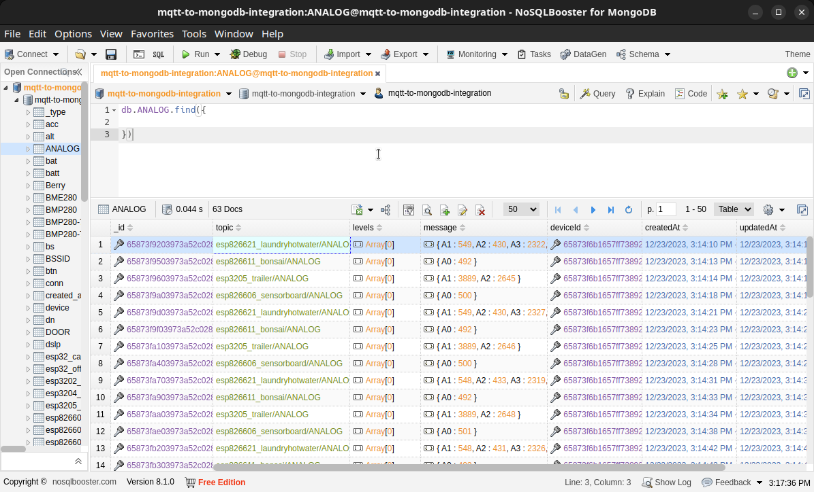

# MQTT-to-MongoDB-Integration

This application parses the topic and message to determine the appropriate MongoDB collection and document to create or update on the fly

Here's a brief overview of how it works:

The application connects to the MQTT broker using the provided URL, username, password, and client ID.

It subscribes to all topics on the MQTT broker.

Before saving the message, it checks if a device with the same deviceId already exists in the database. If not, it creates a new device document.

When a message is received, it parses the topic to determine the collection name. If the message is a JSON object, it iterates over the keys in the object. For each key, it creates a new Mongoose model with the key as the collection name and saves the message as a document in that collection. References deviceId.

If the message is not a JSON object, it creates a new Mongoose model with the collection name derived from the topic and saves the message as a document in that collection.References deviceId.

#

I'm using Tasmota (mostly), and this is an example of the tables:

_Devices_

_Collections_

_Analog Data_

### Next steps:

Implement GraphQL to watch real-time node visualizations. Stay tuned
